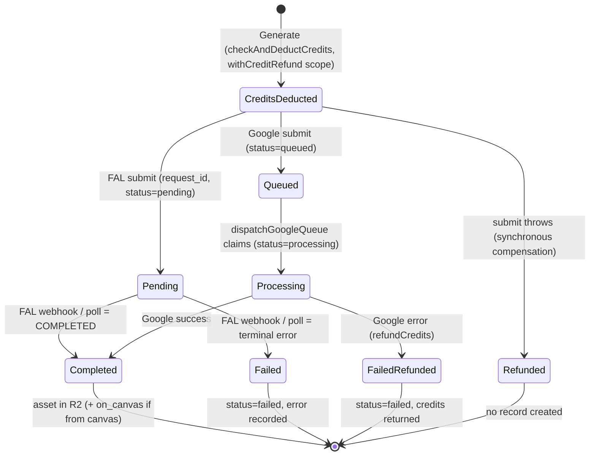

# Architecture

A map of how GenZen is shaped — the contexts, the central data model, the
recurring patterns, and the deliberate seams. Read this to orient before
diving into a feature; each feature also has its own `CLAUDE.md` with local
detail. This is the "what shape is this and where does X live" document.

> Status: living doc. It describes the system as it is today (single-user,
> learning phase) and flags the seams where it will bend under known future
> pressure (collaboration, more media types).

---

## One-liner

An authenticated app where users spend **credits** to generate **AI image
assets** via external providers, then organize those assets in two views — a
gallery (**AI Images**) and a spatial board (**Canvas**). Under the costume,
it's a **saga engine**: each generation is a long-running, compensatable
process across an external provider.

---

## Runtime topology (where code runs)

| Layer                 | Where                                       | Notes                                                                                 |
| --------------------- | ------------------------------------------- | ------------------------------------------------------------------------------------- |
| UI                    | React 19 (TanStack Start, Vite)             | feature-sliced under `src/features/*`                                                 |
| Server functions      | `*.server.ts` via TanStack `createServerFn` | the app's "application layer"                                                         |
| Internal server impls | `*-internal.server.ts`                      | called directly by MCP tools / other server fns to avoid TanStack RPC stub corruption |
| HTTP routes           | `server/api/*` (Nitro h3)                   | webhooks (Stripe, FAL) — Supabase edge functions are **not** used                     |
| Data                  | Supabase Postgres + RLS                     | per-user row security                                                                 |
| Realtime              | Supabase channels                           | live updates (Activity subscribes today)                                              |
| Object storage        | Cloudflare R2                               | persistent public URLs (no expiry)                                                    |
| Client cache          | IndexedDB                                   | **canvas layout only** — never image data                                             |
| Providers             | FAL, Google, OpenAI, xAI                    | behind an anti-corruption layer                                                       |

---

## Bounded contexts (the map)

1. **Identity & Access** — Supabase auth. Mostly plumbing; provides the
   `user_id` that every other context correlates on. `requireAuth()` is the
   gate.
2. **Generation** _(core domain)_ — turning a prompt (+ optional source /
   reference images) into an asset via a provider. Where the real logic and
   the money live.
3. **Billing / Wallet** _(supporting, cleanest model)_ — credits, top-ups
   (Stripe), deduction, refunds. Append-only ledger with idempotency.
4. **Asset Library / Workspace** — owning, organizing, viewing, trashing
   assets. **AI Images** and **Canvas** are two sibling presentations over
   the _same_ assets (see "Shared core, sibling views").
5. **Activity** _(read model, not a context)_ — a CQRS-style projection over
   generation rows. Query-only; never written to directly.

---

## The central aggregate: `user_images`

One table is the spine of the app. It is deliberately overloaded — a single
row simultaneously plays four roles:

| Role                          | Columns                                    |
| ----------------------------- | ------------------------------------------ |
| Asset identity & storage      | `id`, `user_id`, `storage_path`, `source`  |
| Generation lifecycle          | `status`, `request_id`, `generation_error` |
| Canvas membership             | `on_canvas`                                |
| Trash                         | `deleted_at`                               |
| Everything else (VO grab-bag) | `generation_metadata` (JSONB)              |

**Why it's collapsed (a feature, not just debt):** because a canvas image
_is_ the same row as a library image, identity is never duplicated, and the
JSONB bag absorbs domain churn without a migration every week. At
learning-phase velocity that's the right trade.

**`generation_metadata` is a bag of unmodeled value objects** — `prompt`,
`model` (+ resolved `fal_model_id`), `aspect_ratio`, cost fields,
`submitted_at`/`completed_at`/`failed_at`, `reference_image_ids`, `error`.
If/when these stabilize, this is the first place to extract real VOs.

**Split trigger:** don't split this on principle. Split into
`Asset` / `GenerationJob` / `CanvasPlacement` / `TrashEntry` only when those
concerns start _fighting_ in the same code paths — collaboration is the most
likely trigger (see "Known seams").

---

## Key patterns & conventions

### Server functions vs internal impls vs HTTP routes

- `createServerFn` wrappers are the public application API for the client.
- `*-internal.server.ts` holds the real logic, callable directly (MCP tools,
  other server fns) without going through the RPC stub.
- `server/api/*` Nitro routes handle inbound webhooks. (No Supabase edge
  functions — that path doesn't work for us.)

### Provider anti-corruption layer (ACL)

The domain speaks one language ("generate from this image with this model");
providers speak many. The ACL normalizes them:

- `ai-images/models.ts` — the **ubiquitous-language glossary**: friendly model
  names → provider endpoint ids, plus `imageInputModelId` (the edit/img2img
  endpoint a source image must route to).
- `fal-params.server.ts` + `fal-schema.server.ts` — resolve each model's wire
  params from its live OpenAPI schema.
- One lifecycle is presented over FAL / Google / OpenAI differences.

> The ACL leaks when the glossary lies. A model registered against the wrong
> endpoint (e.g. a text-to-image id where img2img was meant) silently drops
> the source image. Guarded by `src/features/canvas/canvas-models.test.ts`.

### The Generation Saga (with compensation)

A generation is **not a transaction** — it's a long-running process with a
compensating action (credit refund) on failure. See the diagram below.

### CQRS read model

**Activity** (`activity/server/list-activity.server.ts`) is a pure projection
over `user_images` (`source = 'ai_generated'`), with in-memory aggregation for
totals. No status/`deleted_at` filtering by default — it's the audit trail,
including failures and soft-deleted rows.

### Canvas: DB owns membership, IndexedDB caches layout

- **DB is the source of truth for _which_ assets are on a canvas** (`on_canvas`)
  and for asset identity.
- **IndexedDB caches _where_ they sit** (positions, groups, transform) — best
  effort, debounced. Never image data.
- On mount, a reconcile pass re-derives membership from the DB so a stale or
  wiped local cache always heals. Durability contract for what survives a
  reload is the pure `cleanImagesForSave` / `filterLoadedImages`
  (`canvas/lib/persistence.ts`, unit-tested).

### Event transport: webhooks + a polling reconciler

Generation lifecycle "events" travel via FAL webhooks **and** a polling
reconciler (`check-pending-generations.server.ts`) that catches anything a
missed webhook left behind. Google generations are driven by a queue
dispatcher (`google-queue.server.ts`).

### Credits ledger + idempotency

`credit_transactions` is append-only; balance is a fold over it. Stripe grants
are idempotent via `stripe_event_id`. Deduction/refund live in
`check-credits.server.ts` (`checkAndDeductCredits`, `refundCredits`,
`withCreditRefund`).

### Functional core, imperative shell (the testing seam)

The pattern the test suite leans into: push decision logic into **pure
functions** at the edges of the imperative (React/async) shell, and test those.
Examples already extracted: `mapOutcomesToPlaceholders`
(`canvas/lib/generation-mapping.ts`), `layoutMasonry`, the canvas-model registry
invariants, the persistence durability filters. This buys most of the
testability of heavier patterns with little ceremony, and it composes with the
feature slices instead of replacing them.

---

## The Generation Saga



**Compensation is asymmetric — a known gap, documented honestly:**

| Failure point                        | Refunded?                | Path                                                                            |
| ------------------------------------ | ------------------------ | ------------------------------------------------------------------------------- |
| Synchronous submit throws            | ✅ yes                   | `withCreditRefund` wraps the submit scope                                       |
| Google async failure (in queue)      | ✅ yes                   | `google-queue.server.ts` → `refundCredits`                                      |
| **FAL async failure** (webhook/poll) | ⚠️ **no visible refund** | `markGenerationFailedWithBlob` marks `failed` but does not call `refundCredits` |

Activity _displays_ `$0` for any failed run (`computeUserCostCents` forces it),
which can **mask** the FAL-async case where the credit was deducted and not
returned. Reconciling that — make every terminal `failed` transition the single
place that also compensates — is the highest-value cleanup in this context.

---

## Shared core, sibling views (the "parity" principle)

AI Images and Canvas are **not** "primary + variant." They're two
presentations over a shared set of operations. The healthy mental model:

> The **operations** are primary. AI Images and Canvas are sibling shells.

- **Already shared (parity is ~free here):** generation. Canvas reuses
  `useGenerator`, `GeneratorPanel`, and the `generateImage` server fn — so
  generation behaviour stays in lockstep by construction, not by discipline.
- **Not yet shared (parity is manual here):** asset operations
  (upload, delete/trash, reorder, group) and the optimistic/polling flows are
  implemented per-view (`use-images` for AI Images; `use-canvas-generate` +
  `persistence` for Canvas). Keeping them in parity is a maintenance burden,
  not a structural guarantee — this is the friction you feel when mirroring a
  change across both.

**Direction that makes parity structural:** factor the asset operations into a
thin shared application layer (use-cases) that both shells call; let each shell
own only its view-local state (gallery sort / selection vs canvas layout /
groups). Then a _third_ view (or re-adding **video**) is "new shell + new
provider," not a reimplementation. The data model is already largely
media-agnostic (assets + lifecycle), so a new media type is mostly a provider
in the ACL plus a presentation — not a core reshape.

**Presentation parity** has its own contract:
[`docs/generation-presentation-contract.md`](docs/generation-presentation-contract.md)
— the single source of truth for how a generation looks in each state
(in-progress / completed / failed) across every view, the normalized
`GenerationView` shape, and the `<Thumbnail>` reference implementation. Conform
to it when building a view instead of re-deciding "what should loading look
like here."

---

## Where to put things

- New domain logic → a `src/features/<feature>/` slice; read/refresh its
  `CLAUDE.md`.
- Server-only logic → `*.server.ts` (public) or `*-internal.server.ts` (shared
  impl); secrets/service-role stay server-side.
- Inbound webhooks → `server/api/*` (Nitro h3).
- Schema changes → timestamp-prefixed `supabase/migrations/`.
- Decision logic you'll want to test → extract a pure function (functional
  core) and unit-test it.
- A new provider → extend `models.ts` + the FAL/provider ACL; keep the lifecycle
  uniform.

---

## Known seams & future triggers

- **Collaboration / shared canvas** → the big one. Forces Canvas to become a
  first-class **aggregate** (id + members/roles), moves layout _server-side_
  (the `on_canvas` boolean becomes a `canvas_items(canvas_id, image_id, x, y…)`
  join), demands a concurrency model (LWW/CRDT + presence), and splits
  **ownership** from **access** on assets — plus a credit-attribution decision
  ("who pays on a shared canvas"). This is the trigger that justifies promoting
  Canvas and splitting the `user_images` god-table.
- **More media types (video, etc.)** → mostly a new provider in the ACL + a new
  presentation; the asset/lifecycle core is already broadly media-agnostic.
- **God-table pressure** → split `user_images` only when the four roles start
  conflicting in shared code paths.
- **FAL async refund gap** → see the Generation Saga table above.

```

```
