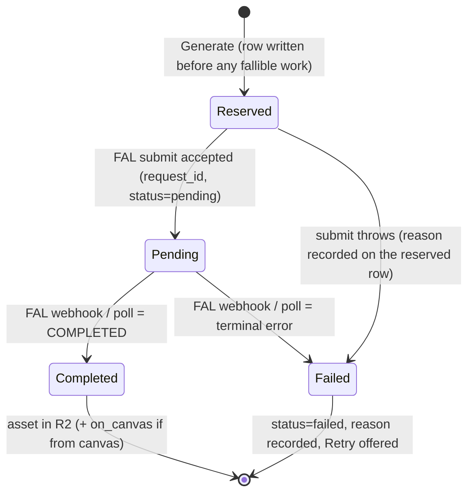

# Architecture

A map of how GenZen is shaped — the contexts, the central data model, the
recurring patterns, and the deliberate seams. Read this to orient before
diving into a feature; each feature also has its own `CLAUDE.md` with local
detail. This is the "what shape is this and where does X live" document.

> Status: describes the **TanStack Start / Supabase** shape, which #168 replaces
> with Next + Postgres + S3 + Node. The topology and naming below go stale with
> that migration; the domain model and the saga framing survive it. Rewrite this
> once #168 lands rather than trusting it verbatim.

---

## One-liner

A single-user app that generates **AI image assets** via FAL, then organizes
those assets in two views — a gallery (**AI Images**) and a spatial board
(**Canvas**). Under the costume, it's a **saga engine**: each generation is a
long-running process across an external provider.

---

## Runtime topology (where code runs)

| Layer                 | Where                                        | Notes                                                                     |
| --------------------- | -------------------------------------------- | ------------------------------------------------------------------------- |
| UI                    | React 19 (TanStack Start, Vite)              | feature-sliced under `src/features/*`                                     |
| Server functions      | `*.server.ts` via TanStack `a server action` | the app's "application layer"                                             |
| Internal server impls | `*-internal.server.ts`                       | called directly by other server fns to avoid TanStack RPC stub corruption |
| HTTP routes           | `server/api/*` (Nitro h3)                    | the FAL webhook — Supabase edge functions are **not** used                |
| Data                  | Supabase Postgres + RLS                      | per-user row security                                                     |
| Realtime              | Supabase channels                            | live updates (Activity subscribes today)                                  |
| Object storage        | Cloudflare R2                                | persistent public URLs (no expiry)                                        |
| Client cache          | IndexedDB                                    | **canvas layout only** — never image data                                 |
| Providers             | FAL (images), Google Gemini (vision)         | behind an anti-corruption layer                                           |

---

## Bounded contexts (the map)

1. **Identity & Access** — Supabase auth. Mostly plumbing; provides the
   `user_id` that every other context correlates on. `requireAuth()` is the
   gate.
2. **Generation** _(core domain)_ — turning a prompt (+ optional source /
   reference images) into an asset via a provider. Where the real logic and
   the money live.
3. **Asset Library / Workspace** — owning, organizing, viewing, trashing
   assets. **AI Images** and **Canvas** are two sibling presentations over
   the _same_ assets (see "Shared core, sibling views").
4. **Activity** _(read model, not a context)_ — a CQRS-style projection over
   generation rows. Query-only; never written to directly.

---

## The central aggregate: `user_images`

One table is the spine of the app. It is deliberately overloaded — a single
row simultaneously plays four roles:

| Role                          | Columns                                    |
| ----------------------------- | ------------------------------------------ |
| Asset identity & storage      | `id`, `user_id`, `storage_path`, `source`  |
| Generation lifecycle          | `status`, `request_id`, `generation_error` |
| Canvas membership             | `on_canvas`                                |
| Trash                         | `deleted_at`                               |
| Everything else (VO grab-bag) | `generation_metadata` (JSONB)              |

**Why it's collapsed (a feature, not just debt):** because a canvas image
_is_ the same row as a library image, identity is never duplicated, and the
JSONB bag absorbs domain churn without a migration every week. At
learning-phase velocity that's the right trade.

**`generation_metadata` is a bag of unmodeled value objects** — `prompt`,
`model` (+ resolved `fal_model_id`), `aspect_ratio`, cost fields,
`submitted_at`/`completed_at`/`failed_at`, `reference_image_ids`, `error`.
If/when these stabilize, this is the first place to extract real VOs.

**Split trigger:** don't split this on principle. Split into
`Asset` / `GenerationJob` / `CanvasPlacement` / `TrashEntry` only when those
concerns start _fighting_ in the same code paths — collaboration is the most
likely trigger (see "Known seams").

---

## Key patterns & conventions

### Server functions vs internal impls vs HTTP routes

- `a server action` wrappers are the public application API for the client.
- `*-internal.server.ts` holds the real logic, callable directly (other server fns,
  other server fns) without going through the RPC stub.
- `server/api/*` Nitro routes handle inbound webhooks. (No Supabase edge
  functions — that path doesn't work for us.)

### Provider anti-corruption layer (ACL)

The domain speaks one language ("generate from this image with this model");
providers speak many. The ACL normalizes them:

- `ai-images/models.ts` — the **ubiquitous-language glossary**: friendly model
  names → provider endpoint ids, plus `imageInputModelId` (the edit/img2img
  endpoint a source image must route to).
- `fal-params.server.ts` + `fal-schema.server.ts` — resolve each model's wire
  params from its live OpenAPI schema.
- One lifecycle is presented over each FAL endpoint's differences.

> The ACL leaks when the glossary lies. A model registered against the wrong
> endpoint (e.g. a text-to-image id where img2img was meant) silently drops
> the source image. Guarded by `src/features/canvas/canvas-models.test.ts`.

### The Generation Saga

A generation is **not a transaction** — it's a long-running process whose
outcome arrives later, out of band. See the diagram below.

### CQRS read model

**Activity** (`activity/server/list-activity.server.ts`) is a pure projection
over `user_images` (`source = 'ai_generated'`), with in-memory aggregation for
totals. No status/`deleted_at` filtering by default — it's the audit trail,
including failures and soft-deleted rows.

### Canvas: DB owns membership, IndexedDB caches layout

- **DB is the source of truth for _which_ assets are on a canvas** (`on_canvas`)
  and for asset identity.
- **IndexedDB caches _where_ they sit** (positions, groups, transform) — best
  effort, debounced. Never image data.
- On mount, a reconcile pass re-derives membership from the DB so a stale or
  wiped local cache always heals. Durability contract for what survives a
  reload is the pure `cleanImagesForSave` / `filterLoadedImages`
  (`canvas/lib/persistence.ts`, unit-tested).

### Event transport: webhooks + a polling reconciler

Generation lifecycle "events" travel via FAL webhooks **and** a polling
reconciler (`check-pending-generations.server.ts`) that catches anything a
missed webhook left behind.

### Reserve-then-fail: a click always leaves something behind

The `user_images` row is written **before** any fallible work, not after FAL
accepts the job. Every outcome is therefore visible as a card: pending, then
completed, or failed with its reason and a working Retry. See
`create-pending-generation.server.ts` and `docs/plans/visible-failures.md`.

### Functional core, imperative shell (the testing seam)

The pattern the test suite leans into: push decision logic into **pure
functions** at the edges of the imperative (React/async) shell, and test those.
Examples already extracted: `mapOutcomesToPlaceholders`
(`canvas/lib/generation-mapping.ts`), `layoutMasonry`, the canvas-model registry
invariants, the persistence durability filters. This buys most of the
testability of heavier patterns with little ceremony, and it composes with the
feature slices instead of replacing them.

---

## The Generation Saga



There is no compensation step, because there is nothing to compensate: FAL
bills the account directly and Activity reports what it charged. The invariant
that replaced it is simpler and stronger — **a click always leaves something on
the board.**

---

## Known seams & future triggers

- **Collaboration / shared canvas** → the big one. Forces Canvas to become a
  first-class **aggregate** (id + members/roles), moves layout _server-side_
  (the `on_canvas` boolean becomes a `canvas_items(canvas_id, image_id, x, y…)`
  join), demands a concurrency model (LWW/CRDT + presence), and splits
  **ownership** from **access** on assets. This is the trigger that justifies promoting
  Canvas and splitting the `user_images` god-table.
- **More media types (video, etc.)** → mostly a new provider in the ACL + a new
  presentation; the asset/lifecycle core is already broadly media-agnostic.
- **God-table pressure** → split `user_images` only when the four roles start
  conflicting in shared code paths.

```

```
